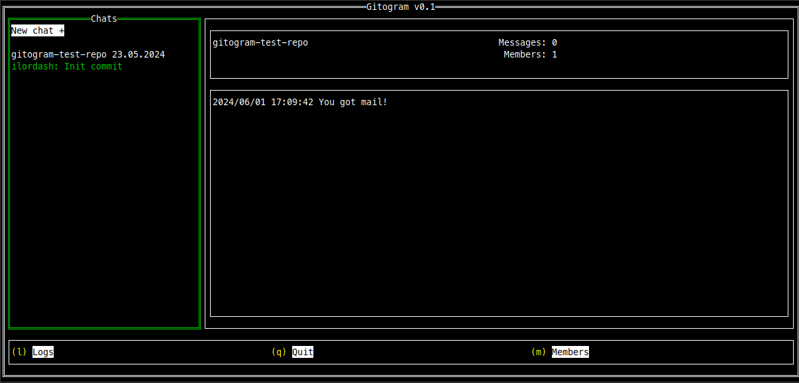

# The Gitogram Project


Gitogram is a CLI Git-based messenger, where you can treat all messages as commits, topics as branches and group chats as repos. All branches can be merged in main branch and so on.

Main idea came from my father's message - [@viordash](https://github.com/viordash):


Translation:
> A git-based messenger. Just a UI wrapper over the git. Messages are comments on a commit. One repo is one group chat. Authorization is native from git. It is convenient to discuss a separate topic, aka a separate brunch. Then you can pour the discussion into the general chat. Or throw it out by closing the chat. Or squash just a discussion digest

# Prerequisities
To use Gitogram you should somewhere store your repositories, aka *chats*. You can setup Git service, e.g. [Gogs](https://github.com/gogs/gogs), on your server.

# How to setup Gogs and configure your Git credentials

1. Run Gogs in Docker:

Pull image  and create a local directory for volume:

```shell
docker pull gogs/gogs
mkdir -p /var/gogs
```

Run Docker:

```shell
docker run \
--name=gitogram-server \
--publish 8022:22 \
--publish 3000:3000 \
-v `pwd`/gogs-data/:/data gogs/gogs
```

  * *name* - Docker container name.
  * *publish* (first) - instructs Docker to open port 8022. We will use this port to access Gogs via git/ssh.
  * *publish* (second) - defines 3000 as the port at which you will be able to access the web interface of Gogs.

2. Setup Gogs

	Open Gogs web interface at it's address and 3000 port. At the setup page fill this fields:

	  * **Database Type** - SQLite3.
      * **Domain** - Replace *localhost* with the your IP address.
      * **Application URL** - In the predefined string, replace only *localhost* with the your IP address, e.g. http://192.168.0.170:3000/.

	You can optionally setup Admin Account in Optional Settings:

      * **Username** - Setyour Git username.
	  * **Password** - Set your password with at least 8 characters.
	  * **E-mail** - Set your Git email address.

	To finish setting up your Gogs press **Install Gogs** button. After that, you'll be able to login with defined *Username* and *Password*.

3. Create your repository

	To create your own repository click **green plus** button. Fill all required fiedls and click **Create Repository** button.

4. Setup your SSH keys

	> Full Github guide to setup your SSH keys: [Connecting to GitHub with SSH](https://docs.github.com/en/authentication/connecting-to-github-with-ssh)

	Generate a new SSH key with the following Terminal command and press **Enter** for every promts you'll get during generating:
	```shell
	ssh-keygen -t ed25519 -C "your_git_email@example.com"
	```

	Start the ssh-agent in the background:
	```shell
	eval "$(ssh-agent -s)"
	```
	Add new generated SSH key to the ssh-agent:
	```
	ssh-add ~/.ssh/id_ed25519
	```
	Add your SSH key to Gogs account. To do this follow to *Account Settings* page (**equalizer-like** button on right-top of Gogs web page), then open *SSH keys* Settings page and press **Add Key** button. Add your own *Key Name*, then copy the SSH public key with the following Terminal command and paste it to *Content* field:
	```
	cat ~/.ssh/id_ed25519.pub
	```
	Press green **Add Key** button.

	> **Your .ssh/known_hosts should be placed at $HOME**

## To build:
```
$ make run
```

## How to add chat and start messaging

1. Follow the repository web page, and click on the **black cloud** button. Choose *SSH link* and copy it.
2. In the Gitogram press **New chat +** button, paste and modify copied link, so it should look like this:
	```
	ssh://git@192.168.0.170:8022/my-name/demo-repo.git
	```
	Click **Add** button.
3. After successfully adding a new chat, you'll see it on the left *Chats* panel. Chosse your chat, press **Enter**, follow to *Message* field and start typing. Send message with **Enter**.

