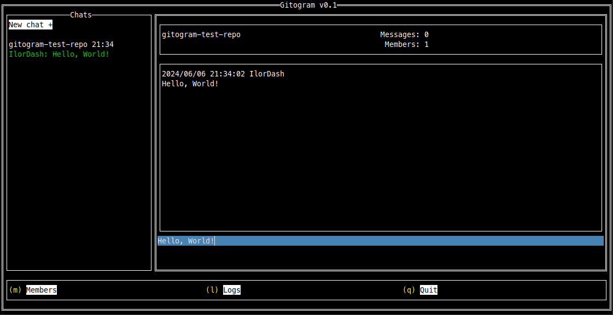

# The Gitogram Project

Gitogram is a CLI Git-based messenger, where you can treat all messages as commits, topics as branches and group chats as repos. All branches can be merged in main branch and so on.

Main idea came from my father's message - [@viordash](https://github.com/viordash):


Translation:
> A git-based messenger. Just a UI wrapper over the git. Messages are comments on a commit. One repo is one group chat. Authorization is native from git. It is convenient to discuss a separate topic, aka a separate brunch. Then you can pour the discussion into the general chat. Or throw it out by closing the chat. Or squash just a discussion digest

To build:
```
$ make run
```

